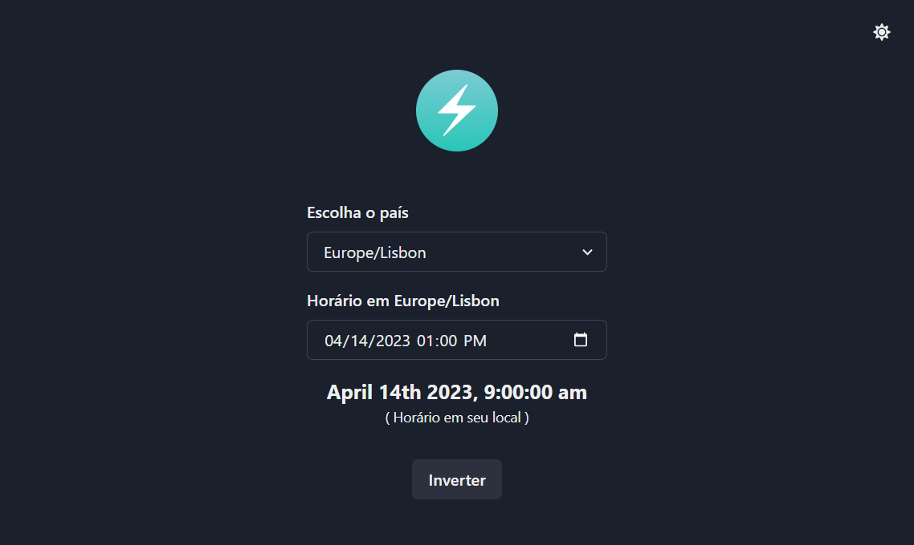

# Time Zone Converter

### Description:
Time Zone Converter is a simple web application built with React and Chakra UI that allows users to convert local time to different time zones and vice versa. It uses the World Time API to fetch the list of available time zones and to perform the time zone conversions.

The application features a dropdown menu for selecting the desired time zone and an input field for entering the local time. Users can toggle between converting from the local time to the selected time zone and vice versa. The converted time is displayed below the input fields.

### Invitation:
We invite developers who are interested in React and web development to contribute to the Time Zone Converter project. There are many ways to improve the application, such as adding new features, improving the user interface, and optimizing the code. We welcome any contributions, big or small, and we believe that working together, we can create a better tool for users around the world.
